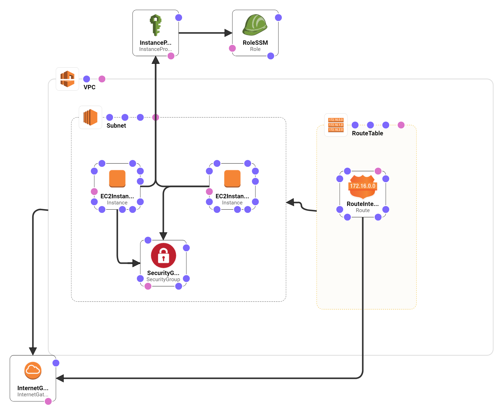

## A demo to run wrk and save the result file to S3

This demo runs wrk on Amazon EC2, save its results into `.json` along with EC2 metadata,
then save the `.json` file into S3.

It's based on my previous work 
    - run wrk and save results to Firebase https://richardimaoka.github.io/blog/benchmarking-with-wrk-fireabase/
    - and a demo to copy a dummy file from EC2 to S3: https://github.com/richardimaoka/aws-ec2-to-s3

## How to run the demo?

### Pre-requisite
- Install AWS CLI, and configure it with an API key/secret having AWS Admin access
- Create an S3 bucket to save the result file, and update the `BUCKET_NAME` variable in `run-wrk.sh`
- (Create an EC2 key-pair in advance for SSH access, as Cloudformation doesn't create key pairs )
  - (Yes, the whole purpose of this demo is build a processing pipeline not using SSH, but in case of troubleshooting, you would still want SSH)

### Then, just run this

- From your local PC
- `git clone https://github.com/richardimaoka/aws-cloudformation-wrk.git`
- `cd aws-cloudformation-wrk`
- run `./local-commands.sh`
  - this will create a Cloudformation stack in your AWS account from the template file, `cloudformation.yaml` in this repository
  - An EC2 instance running nginx, and the other EC2 instance to run wrk will be crated
  - `local-commands.sh` waits until Cloudformation stack creation is complete, and sends an AWS System Manager command to the wrk EC2 instance
  - the command executes `run-wrk.sh` on the EC2 instance, and save the resulting file `results.txt` to S3

## Things to note

- [AWS Systems Manager](https://docs.aws.amazon.com/systems-manager/latest/userguide/what-is-systems-manager.html) is used to execute remote commands on EC2 via AWS CLI, so that I didn't need to use SSH's interactive shell to run arbitrary commands. Without SSH, the workflow is more streamlined
  - [Official video resources for AWS System Manager](https://www.youtube.com/watch?v=zwS8lssaY_k&list=PLhr1KZpdzukeH5jKyYi55ef9tEWAllypB)
  - After `local-commands.sh` sent the AWS System Manager command, go to the following page and check the command status:
https://console.aws.amazon.com/ec2/v2/home?#Commands:sort=CommandId

## Cloudformation Stack

Illustrated by [Cloudformation Designer](https://console.aws.amazon.com/cloudformation/designer/home):
(S3 bucket is not here as I created it in advance, but you can create a new bucket from Cloudformation too if you extend my `cloudformaiton.yaml`)

